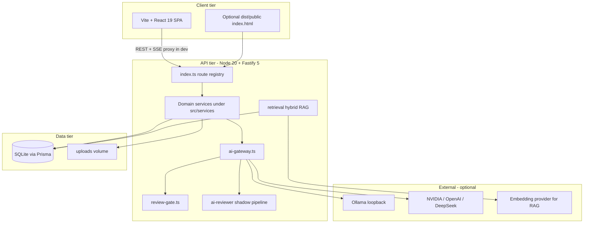

# LocalAkademi — Project Audit

**Audit date:** 2026-07-25  
**Mode:** Read-only analysis (no code, schema, or dependency changes were made during this review).  
**Scope:** Monorepo root (`localakademi-server` + `frontend/`), Prisma/SQLite, Docker, Vitest suites, operational scripts.

---

## 1. Overall architecture

LocalAkademi is a **Turkish-language, AI-assisted learning platform** for SMEs and entrepreneurs. It combines structured curriculum (courses, lessons, knowledge objects, quizzes, flashcards, videos, tasks) with conversational AI mentoring and optional long-term user memory.

### High-level layout



### Composition

| Layer | Technology | Notes |
|--------|------------|--------|
| API | Fastify 5, TypeScript, Zod | ~46 route modules registered from `src/index.ts` |
| ORM | Prisma 5, SQLite | Single-file DB; embeddings stored as JSON strings on `KnowledgeObject` |
| Auth | `@fastify/jwt`, bcrypt | Role string on `User`; JWT payload carries `id`, `email`, `role` |
| AI | `ai-gateway` + providers | Review gate, masking, optional AI reviewer shadow mode |
| RAG | Lexical + semantic + RRF hybrid | In-process cosine similarity over up to ~500 candidates |
| Frontend | React 19, Vite 6, React Router 7 | JSX (not TypeScript); CSS modules + design tokens |
| Ops | 69 scripts in `scripts/`, Docker | Server-only image; Postgres/Redis compose profiles are future placeholders |

### Deployment model

- **Development:** Backend `npm run dev` (tsx + `.env`); frontend separate on port 5173 with Vite proxy to `:3000`.
- **Production Docker:** Builds TypeScript to `dist/`, runs `prisma migrate deploy`, serves API + bundled `src/public` static fallback—not the Vite SPA unless deployed separately.
- **Content pipeline:** Heavy offline tooling (curriculum build, KO import, quiz/flashcard seeding, RAG indexing) lives in npm scripts rather than in-app jobs.

---

## 2. Frontend analysis

### Structure

- **Entry:** `frontend/src/main.jsx` → `router/index.jsx` with lazy-loaded pages.
- **State:** `AuthContext` (JWT in `localStorage`), `ToastContext`.
- **API:** Central `frontend/src/services/api.js` (~600 lines) wrapping `fetch`, SSE streaming, and grouped namespaces (`auth`, `conversation`, `knowledgeV2`, `community`, etc.).
- **UI:** Reusable components under `components/ui/` (DataTable, QuizWidget, VideoPlayer, TaskWorkspace, etc.) and admin KO workflows under `pages/admin/`.
- **Styling:** CSS modules + `styles/tokens.css`; no component library beyond Lucide icons.

### Strengths

- Lazy routes and shared layout (`AppLayout`, `ProtectedRoute`) keep initial bundle reasonable.
- `MentorPage` implements full streaming UX (abort, regenerate, edit-and-regenerate, memory panel).
- Role-aware admin routing mirrors backend RBAC (`admin`, `content_editor`, `subject_expert`).

### Risks and inconsistencies

1. **No TypeScript on frontend** — API contracts drift from backend Zod schemas; errors surface at runtime only.
2. **Dual API prefix convention** — Most calls use bare paths (`/auth`, `/courses`); conversations and v2 KO APIs use `/api/...`. Dev works via Vite rewrite (`/api` → strip prefix); **production** with `VITE_API_URL` pointing at the API host requires the same rewrite at the edge or broken conversation/KO paths.
3. **Incomplete Vite proxy** — `vite.config.js` proxies many prefixes but **omits `/community`** (and possibly others). Community pages may fail in local dev unless requests go through a full reverse proxy.
4. **Legacy API surface in client** — `api.mentor` (`/mentor/chat`, history) is defined in `api.js` but **not referenced** by `MentorPage`; UI uses `api.conversation` only.
5. **JWT in localStorage** — Standard SPA pattern but XSS on any page would exfiltrate tokens; no httpOnly cookie option.
6. **Auth onboarding default** — `AuthContext` initializes `onboardingCompleted` to `true` before `/auth/me` returns, which can flash wrong gating UX.
7. **Test coverage** — Only three frontend tests (`Sidebar`, `CoursePlayerPage`, `LearningInteractions`); most pages untested.

### Static duplicate

- `src/public/index.html` (~15 KB) is served by Fastify when present; separate from the Vite app. Risk of operators serving the wrong UI in production.

---

## 3. Backend analysis

### Organization

- **Bootstrap:** `src/server.ts` → `src/index.ts` (`build()`, `start()`, graceful shutdown).
- **Pattern:** One Fastify plugin per domain file (`*Routes` exported, registered with prefixes in `index.ts`).
- **Cross-cutting:** Audit logging (`audit.ts`), secure logging, document security, zip helpers, spaced repetition, quiz engine.

### Strengths

- Structured shutdown (`SHUTDOWN_TIMEOUT_MS`, SIGTERM/SIGINT).
- Logger redaction for auth headers and secrets.
- Per-route rate limits on auth and mentor chat.
- Extensive Vitest coverage for AI gateway, reviewer, retrieval, security, and conversations.
- Factory-style DI in some modules (`community`, `quizzes`, `learning`, `documents`) for testing.

### Weaknesses

1. **Many `PrismaClient` instances** — 30+ modules each call `new PrismaClient()` (or create one per plugin invocation). This increases connection overhead and complicates lifecycle/testing vs a shared singleton.
2. **Route prefix inconsistency** — Mix of prefixed plugins (`/courses`, `/mentor`) and absolute paths inside plugins (`/api/v2/...`, `/learning/...`, `/formulas`, `/onboarding/...`).
3. **Duplicate dashboard registration** — Both `learnerDashboardRoutes` and `pilotDashboardRoutes` mount on **`/dashboard`** (`/` and `/pilot` respectively); works but is easy to misread.
4. **Memory API gated** — `ENABLE_MEMORY_API === 'true'` required; frontend `MemoryPanel` assumes API availability.
5. **Operational script sprawl** — 69 maintenance scripts increase release/process risk if not all documented in CI.
6. **`console.log` for CORS** on every boot — noisy and may leak config in shared logs.

### Entry-point packaging bug

- `package.json` `"main": "dist/index.js"` but `"start"` runs **`dist/server.js`**. Docker entrypoint correctly uses `dist/server.js`; tooling that respects `main` may target the wrong file.

---

## 4. Prisma schema review

### Domain model (781 lines)

Rich LMS + content-management model:

- **Identity:** `User`, `UserPreference`, roles as free-form `String`.
- **Content:** `KnowledgeObject` with structured fields (`summary`, `learnSteps`, versioning via `KnowledgeObjectVersion`, `PublicationEvent`, `ReviewRecord`).
- **Taxonomy:** `Category` (self-referential parent/child).
- **Learning:** `Course`, `Lesson`, `LessonProgress`, `Enrollment`, `KnowledgeProgress`, `LearningPath`.
- **Assessments:** `Quiz`, `QuizQuestion`, `QuizAttempt`, `TaskTemplate`, `TaskAssignment`.
- **Media:** `LearningVideo`, `VideoProgress`, `VideoProductionJob`, `Flashcard*`.
- **AI chat:** `Conversation`, `ConversationMessage` (citations, soft metadata), `MentorSession` (legacy JSON context), `UserMemory`, `ConversationSummary`.
- **Community:** `CommunityPost`, `CommunityReport`.
- **Governance:** `AuditLog`, `ImportJob`, `AiReviewerTelemetry`, `AiReviewerHumanAudit`.
- **Business tools:** `BusinessProfile`, `BusinessAssessment`, `FormulaCalculation`, documents, reports.

### Schema strengths

- Indexes on common filters (community status, flashcard due dates, audit queries, reviewer telemetry retention).
- KO lifecycle fields align with `state-machine.ts` (`draft` → `in_review` → `approved` → `published` → `archived`).
- Cascade deletes on user-owned rows are largely consistent.

### Schema concerns

| Issue | Impact |
|--------|--------|
| `User.role`, KO `status`, etc. as `String` | No DB-level enum safety; typos possible |
| `QuizAttempt.koId` without `@relation` to `KnowledgeObject` | Referential integrity not enforced |
| `KnowledgeObject.embedding` as `String` | Full-table scans for semantic search; no pgvector despite compose stub |
| JSON blobs in many columns (`metadata`, `answers`, `pathData`) | Hard to query; validation only in app layer |
| `MentorSession.context` stores message array JSON | Parallel persistence model vs `Conversation` |
| SQLite in production | Write concurrency and backup/scale limits for multi-tenant growth |
| Prisma version drift | `package.json` lists `^5.14.0`; `allowScripts` references `5.22.0` |

### Migrations

- 20+ dated migrations under `prisma/migrations/`; `docker-entrypoint.sh` runs `migrate deploy`.
- Test suite uses `pretest` script to apply migrations to test DB.

---

## 5. API consistency

### Prefix and versioning

| Style | Examples | Consumer |
|--------|----------|----------|
| Versioned absolute paths | `/api/v2/knowledge-objects`, `/api/v2/admin/...` | Frontend `knowledgeV2`, e2e tests |
| Legacy resource prefix | `/knowledge/search`, `/knowledge/:id` | Deprecated; still public |
| Plugin prefix + inner path | `/mentor/conversations`, `/courses`, `/community/posts` | SPA |
| Root-absolute in plugin | `/learning/start`, `/onboarding/status`, `/formulas` | SPA |

### Error shape

- Mix of `{ error: string }`, `{ error, details }`, and structured validation codes (`VALIDATION_ERROR`) in conversation routes—not fully uniform for client parsing.

### Auth expectations

| Endpoint class | Auth |
|----------------|------|
| Public KO read (v2 list/detail, topics) | Optional JWT for admin preview of non-published |
| Legacy `/knowledge/*` GET | Public for published |
| Legacy POST `/knowledge` | Admin |
| Conversations | Global `preHandler` authenticate |
| Legacy `/mentor/chat` | Authenticated |
| Admin v2 transitions | Role checks per action |

### Dev vs prod path mapping

- Frontend `api.conversation.BASE = '/api/mentor/conversations'` relies on Vite rewriting to `/mentor/conversations`. Document this explicitly for any deployment without Vite.

---

## 6. Authentication review

### Implementation (`src/services/auth.ts`)

- Registration: email normalize, password 10–128 chars, bcrypt cost 10, invite-only beta gate.
- Login: generic "Invalid credentials" (good anti-enumeration).
- JWT: **`JWT_SECRET` required**, minimum 32 bytes or startup fails.
- `/auth/me`: reloads user from DB; exposes onboarding flag.

### Authorization

- `fastify.authenticate` verifies JWT only; **role checks are per-route** (admin, content_editor, subject_expert).
- Frontend `ProtectedRoute` treats **`admin` as superuser** for all `requiredRole` routes (matches typical ops need).

### Gaps

- **No refresh tokens or revocation list** — Compromised token valid until expiry (`JWT_EXPIRES_IN`, default 8h).
- **Role in JWT** — Role changes in DB do not affect outstanding tokens until re-login.
- **No MFA, email verification, or password reset flow** in API (admin scripts exist for bootstrap/reset).
- **Security tests** use plaintext `'hashed_sec'` in DB for speed—not representative of bcrypt path in auth routes when tests bypass real login.

---

## 7. AI Mentor architecture

The product exposes **two parallel mentor stacks**:

### A. Legacy session mentor (`/mentor/*` — `mentor.ts`)

- **POST `/mentor/chat`:** Session stored in `MentorSession.context` JSON.
- **Context:** Optional KO by `code`; otherwise **last 2 published KOs** (not query-based RAG).
- **AI:** `RealAiChatProvider` → `ai-gateway` (masking + review gate + optional reviewer shadow).
- **System prompt:** Local `buildSystemPrompt` in `mentor.ts` (different wording/limits than conversation stack).
- **GET/DELETE `/mentor/history`:** Session cleanup.

### B. Primary conversation mentor (`/mentor/conversations/*` — `conversation.ts`)

- **Persistence:** `Conversation` + `ConversationMessage` with citations, streaming metadata, regenerate/edit flows.
- **RAG:** `getRelevantKnowledgeObjects` via hybrid retriever (`ai-provider.ts`).
- **Prompt:** `buildSystemPrompt` from `ai-provider.ts` (140-word limit, clarification heuristics).
- **Streaming:** SSE via `streamAiResponse` + `stream-manager` slot control.
- **Memory (optional):** Background extraction + summary update; memory context in prompt when enabled.
- **Security:** Input length limits, ownership checks on conversations, review gate on gateway path.

### Shared infrastructure

```text
User message → (optional) hybrid retrieval → system prompt + history
            → sensitive-data masker → reviewInput → AI provider (gateway)
            → reviewOutput → (shadow) AI reviewer queue → response + citations
```

### Observations

- **Frontend uses stack B only**; stack A remains API-compatible but diverges in grounding quality.
- **Ollama SSRF controls** in gateway: loopback hosts only for `ollama` provider.
- **AI reviewer** runs in shadow mode by default; telemetry persisted with retention job on startup.

---

## 8. Knowledge Object architecture

### Content model

- **Canonical entity:** `KnowledgeObject` with optional `code`/`slug`, structured pedagogical fields, compiled `content` (also built by `buildContent()` in `knowledge-v2.ts` on write).
- **Lifecycle:** Enforced in v2 admin routes via `enforceTransition()` (`state-machine.ts`) plus audit logs and publication events.
- **Sources:** `Source` + `KnowledgeObjectSource` for citations in mentor responses.
- **Derivatives:** Quizzes, task templates, flashcards, videos linked by `koId`.

### API surfaces

| Surface | Purpose |
|---------|---------|
| `/knowledge/*` (legacy) | Simple search/get/create; marked deprecated |
| `/api/v2/knowledge-objects` | Public catalog + detail; quiz question redaction for non-editors |
| `/api/v2/knowledge-topics` | Topic aggregation for browsing |
| `/api/v2/admin/knowledge-objects/*` | CRUD + workflow transitions |
| Import/companion plugins | Bulk KO import and companion content commit |

### RAG indexing

- `scheduleKnowledgeObjectEmbedding` on KO changes; embeddings stored as JSON on row.
- Semantic retriever loads candidate set (default limit 500), computes cosine similarity in Node.
- Hybrid retriever merges lexical + semantic with RRF; domain query expansion for Turkish business terms.

### Risks

- **Dual write paths** (legacy POST vs v2 admin) can create KOs without full workflow or embeddings.
- **Demo flag** (`isDemo`) must stay consistent across public endpoints; security tests cover leakage scenarios.
- **Pilot dashboards** hard-code `PILOT_KO_IDS` in `pilotDashboard.ts` — environment-specific fragility.

---

## 9. Security issues

Prioritized findings (not an exhaustive penetration test):

| Severity | Finding |
|----------|---------|
| **High** | JWT in `localStorage` increases impact of any XSS in the SPA or third-party script. |
| **High** | Production deployment without reverse-proxy `/api` rewrite breaks auth paths or exposes misconfigured CORS if `CORS_ORIGIN` wrong. |
| **Medium** | Host defaults to `0.0.0.0` — appropriate for Docker but risky on unsecured networks. |
| **Medium** | Legacy `/mentor/chat` weaker grounding may increase hallucination risk vs RAG conversation path (same review gate, different context). |
| **Medium** | Public legacy `/knowledge/search` returns full KO records including `content` — intentional but heavy; rate limiting not global on that route. |
| **Medium** | Cloud AI keys in environment; gateway enforces provider allowlist but misconfiguration could send data to external APIs. |
| **Low** | CORS config logged to stdout on startup. |
| **Low** | `QuizAttempt` without FK — orphaned attempts possible if KO deleted outside app logic. |
| **Mitigated** | Document upload: magic-byte checks, zip bombs limits (`documentSecurity.ts`), size caps. |
| **Mitigated** | Review gate blocks credential harvesting patterns and disclaimer bypass attempts. |
| **Mitigated** | Ollama URL restricted to loopback interfaces. |
| **Mitigated** | Extensive `tests/security.test.ts` for IDOR on conversations, documents, enrollments, KO states. |

---

## 10. Performance issues

| Area | Issue |
|------|--------|
| **Semantic RAG** | O(n) scan over hundreds of KOs per query with JSON parse + cosine — acceptable for pilot scale, poor at thousands+. |
| **SQLite** | Single writer; concurrent mentor streaming + imports may contend. |
| **Prisma fan-out** | Multiple clients and N+1 patterns in dashboard aggregations (`learnerDashboard.ts` uses parallel queries but still heavy). |
| **Conversation history** | Messages loaded in full for active chat; context truncated in logic but DB reads unbounded per conversation size. |
| **Embedding storage** | Large strings on main KO row bloat row reads for list endpoints unless select clauses omit `embedding`. |
| **AI reviewer queue** | In-memory queue; restart loses backlog (by design, but affects burst sampling). |
| **Static frontend** | No CDN split in server Docker image; API and SPA scaling are separate concerns. |

---

## 11. Duplicate code

| Duplication | Locations | Notes |
|-------------|-----------|--------|
| Mentor system prompts | `mentor.ts` vs `ai-provider.ts` | Different rules/length limits |
| KO context formatting | `mentor.ts` manual truncation vs `retrieval/knowledge-context-formatter.ts` | Legacy path bypasses RAG formatter |
| `buildContent()` | `knowledge-v2.ts` (and import pipelines) | Shared concept but duplicated in scripts |
| Dashboard aggregation | `learnerDashboard.ts` vs `pilotDashboard.ts` | Overlapping Prisma query patterns |
| Prisma bootstrap | Every service file | Should be centralized |
| SSE parsing | Frontend `api.js` vs backend emission helpers | Expected but two parsers to maintain |
| Compiled seed artifacts | `prisma/seed.js`, `.map`, `.d.ts` alongside `seed.ts` | Source of truth ambiguity |

---

## 12. Dead code

| Item | Evidence |
|------|----------|
| `api.mentor` client methods | Defined in `frontend/src/services/api.js`, unused by pages |
| Legacy `/mentor/chat` for current UI | Superseded by conversations; still tested in security suite |
| `src/public/index.html` | Legacy shell if Vite SPA is canonical |
| `prisma/phase1-tests.ts`, `phase2-tests.ts`, `phase3a-tests.ts`, `demo-mark.ts` | Ad-hoc scripts outside Vitest harness |
| `prisma/seed.js` + maps | Generated/committed duplicates of TypeScript seed |
| README stack mentions | Postgres/redis profiles inactive unless compose profile enabled |
| `package.json` `"main": "dist/index.js"` | Misleading vs actual `server.js` entry |

---

## 13. Missing tests

### Backend — modules with little or no dedicated coverage

- `onboarding.ts`, `enrollments.ts`, `lessons.ts`, `courses.ts` (partial via e2e/topic-courses)
- `learnerDashboard.ts`, `pilotDashboard.ts`
- `learningPath.ts`, `formulas.ts`, `reports.ts`
- `import.ts`, `companion-content.ts` (e2e touches v2 admin but not full import/companion matrix)
- `flashcard-routes.ts` / `flashcards.ts` service layer (limited)
- `community` moderation/report resolution edge cases (basic tests exist)
- `knowledge-v2.ts` state machine integration (partially via e2e)
- Legacy `mentor.ts` RAG gap (behavioral drift untested vs conversation)

### Frontend

- Mentor streaming, auth flows, admin KO workflow, community, assessment — **no automated tests**.

### Integration

- No CI-visible test that builds frontend + runs smoke against combined stack except `test:frontend-smoke` script (not run in default `npm test`).

---

## 14. Build risks

| Risk | Detail |
|------|--------|
| **Split deployment** | Docker image does not build/serve Vite `frontend/dist`; operators must deploy two artifacts or add a build stage. |
| **Prisma generate in Docker** | Build stage runs `prisma generate`; runtime must match migrated schema version. |
| **Migration failure on boot** | `docker-entrypoint.sh` fails closed if `migrate deploy` fails — good, but needs backup strategy. |
| **Env required vars** | `JWT_SECRET`, production `CORS_ORIGIN`, `DATABASE_URL` — missing JWT prevents start (intentional). |
| **Fastify pinned** | `"fastify": "5.10.0"` exact pin — reproducible but manual bump burden. |
| **Vitest `fileParallelism: false`** | Safer for SQLite tests but slower CI. |
| **Test DB** | `file:./test.db` — parallel jobs on same workspace could clash without isolation. |
| **Frontend env** | Empty `VITE_API_URL` assumes same-origin or dev proxy; easy misconfiguration in staging. |

---

## 15. Top 20 recommended improvements

1. **Consolidate on one mentor API** — Deprecate `/mentor/chat` or route it through the same RAG + conversation pipeline to eliminate grounding drift.
2. **Centralize `PrismaClient`** — Single module with optional test injection; reduce connection proliferation.
3. **Unify API path strategy** — Either prefix all routes with `/api/v1` or document/production-enforce reverse-proxy rewrite; align `api.conversation.BASE` with backend without rewrite magic.
4. **Complete Vite proxy** — Add `/community`, `/sources`, and any missing backend prefixes for local dev parity.
5. **Migrate frontend to TypeScript** — Shared types generated from Zod or OpenAPI for KO and conversation contracts.
6. **Add `QuizAttempt` → `KnowledgeObject` FK** — Prisma relation + migration for integrity.
7. **Replace string roles/status with enums** — Prisma enums or lookup tables for safer RBAC and KO workflow.
8. **Extract shared mentor prompt builder** — One module used by legacy and conversation paths.
9. **Remove or gate legacy `/knowledge` API** — Redirect clients to v2 only; reduce public surface.
10. **Harden token storage** — Consider httpOnly secure cookies + CSRF strategy for production SPA.
11. **Add refresh or server-side session invalidation** — Especially for admin roles.
12. **Optimize semantic retrieval** — pgvector profile in compose, or ANN index, or pre-filter by category before cosine loop.
13. **Strip `embedding` from list queries** — Ensure all catalog endpoints use explicit `select` without heavy columns.
14. **Docker multi-stage frontend** — Optional target serving Vite build from nginx or Fastify static alongside API.
15. **Delete committed `prisma/seed.js` artifacts** — Single TypeScript seed source; generate in CI if needed.
16. **Fix `package.json` main entry** — Point to `dist/server.js` or export both documented entries.
17. **Expand frontend tests** — Mentor SSE, auth, and admin KO state transitions (RTL + Vitest).
18. **Integration test for import/companion** — Cover preview/commit and job listing under `import.ts` / `companion-content.ts`.
19. **Remove startup `console.log` CORS dump** — Use structured logger at debug level only.
20. **Parameterize pilot KO IDs** — Environment or DB config instead of hard-coded arrays in `pilotDashboard.ts`.

---

## Appendix: test inventory (backend)

~45 Vitest files under `tests/`, including dedicated suites for AI reviewer, retrieval, gateway security, conversations, documents, memory, community, quizzes, video/course progress, e2e KO workflow, admin bootstrap, graceful shutdown, and stabilization.

## Appendix: documentation

README (Turkish) documents stack, env vars, mentor/reviewer behavior, and links to `docs/` (e.g. AI reviewer pilot). Operational truth also lives in npm script names and release verification (`verify:release`, `secret:scan`).

---

*End of audit.*
